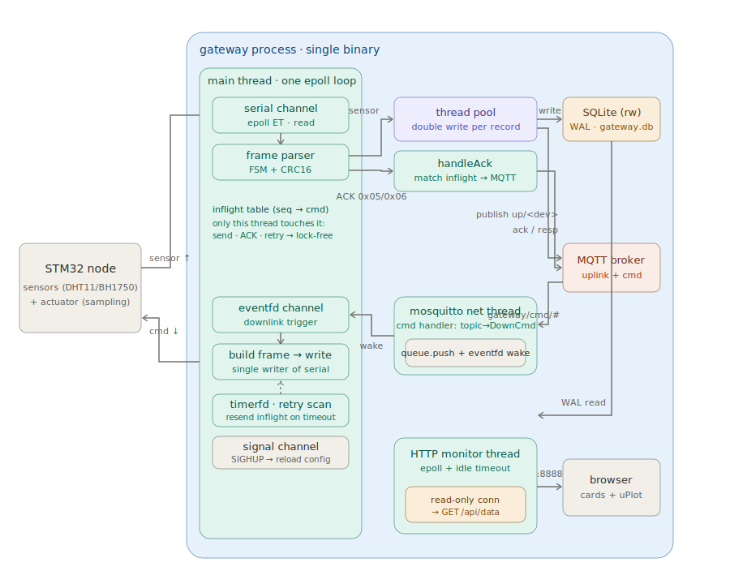

# embedded-edge-gateway

C++17 多协议嵌入式 Linux 边缘网关,目标运行环境:Raspberry Pi 4B。单进程串起「串口采集 → 云端上行」与「云端下发 → 串口控制」的双向数据链路,并内嵌一个轻量 HTTP 监控服务,提供实时网页与历史曲线。

## 架构



**上行(采集)**:STM32 节点经 UART 把传感器数据按自定义二进制帧发到网关。网关主线程是一个 epoll 事件循环,把串口、eventfd、timerfd、信号(SIGHUP)统统作为 channel 挂在同一个循环里。串口数据经帧解析状态机(CRC16 校验)解码成一条条记录后,提交给线程池;每个 worker 同时做两件事——落本地 SQLite、向 MQTT broker 上行发布,即「双写」。

**下行(命令)**:运维往 `gateway/cmd/<命令>` 发 MQTT 消息,mosquitto 网络线程把它翻译成命令、塞进线程安全队列、戳一下 eventfd 唤醒主循环——**自己绝不碰串口**。主循环在 eventfd 回调里分配 seq、组帧(FrameBuilder)、写串口,并登记到「在途表」。STM32 的 ACK/查询应答经串口回来,由解析器配对在途表后销账、再经 MQTT 回发结果;另有一个 timerfd 周期扫描在途表,超时未收到 ACK 就按同一 seq 重发(幂等),重试耗尽判失败。

HTTP 监控服务跑在独立线程,持有一个**只读** SQLite 连接,靠 WAL 与主链的读写连接并发——查询不阻塞落库。浏览器访问即可看到实时设备卡片与 uPlot 历史曲线。

关键设计:

- **统一事件驱动**:串口数据、下行命令(eventfd)、超时重试(timerfd)、SIGHUP 信号(signalfd)全封装成 channel,挂在主线程同一个 epoll 循环上,避免阻塞 read 卡死其他事件。
- **单一写者**:串口 fd 只由主线程写。mosquitto 线程只投递命令到队列 + 戳 eventfd,不直接写串口,因此 `SerialPort` 无需加锁。
- **下行可靠性**:每条命令带 seq 登记在途表,ACK 配对销账,timerfd 超时按同 seq 重发(协议幂等),3 次未果判失败。在途表只被主线程访问(发送 / 收 ACK / 重试同线程)→ 无锁。
- **双写**:每条记录由线程池 worker 同时落本地 SQLite 和 MQTT 上行,互不阻塞。
- **读写并发**:HTTP 查询用独立的只读 SQLite 连接(`SQLITE_OPEN_READONLY`),靠 WAL 与主链写连接并发。
- **配置热加载**:`SIGHUP` 触发 load-then-swap 原子换配置,失败回滚不影响运行中的旧配置;串口/MQTT/DB 按 diff 仅重建真正变化的资源。
- **RAII 析构顺序**:`pool` 最后声明 => 最先析构(drain 在飞任务),此时 `db`/`client` 仍被任务的 shared_ptr 快照持有,无 use-after-free。
- **致命退出**:broker 连不上 / 串口打不开 / 磁盘异常统一被 catch,优雅致命退出,交由 systemd 重启接管。

详细的串口帧协议见 [docs/m5_frame_protocol.md](docs/m5_frame_protocol.md)。

## 构建

依赖:

```bash
sudo apt install -y libsqlite3-dev libmosquitto-dev
```

```bash
cmake -B build -S . -DCMAKE_BUILD_TYPE=Debug
cmake --build build
```

## 运行(端到端)

`gateway` 单进程串起完整数据流,需要本机有一个 MQTT broker(网关启动即连接,连不上会退出)。

```bash
sudo systemctl start mosquitto          # 或 mosquitto -c /etc/mosquitto/mosquitto.conf
```

开发环境用虚拟串口对模拟 STM32 与网关之间的 UART。需要 4 个终端:

**终端 1** — 创建虚拟串口对(`/tmp/ttyV0` 网关侧、`/tmp/ttyV1` STM32 侧),保持运行:

```bash
./scripts/start_vserial.sh
```

**终端 2** — 启动网关。命令行参数是**配置文件路径**(缺省 `/etc/gateway.conf`)。仓库自带的 `src/deploy/gateway.conf` 默认 `serial_path = /dev/ttyUSB0`(真机);用虚拟串口演示时复制一份把 `serial_path` 改成 `/tmp/ttyV0` 再启动:

```bash
sed 's#serial_path =.*#serial_path = /tmp/ttyV0#' src/deploy/gateway.conf > /tmp/gateway.dev.conf
./build/gateway /tmp/gateway.dev.conf
```

**终端 3** — 假 STM32 喂数据(每秒一帧,循环发四类业务帧):

```bash
cd experiments/m5_parser
g++ -std=c++17 -Wall CRC16.cpp fake_stm32.cpp -o fake_stm32
./fake_stm32 /tmp/ttyV1
```

## 验证

浏览器打开 **http://localhost:8888** —— 实时设备卡片,点卡片切换 uPlot 历史曲线。

命令行交叉验证:

```bash
# SQLite 落库
sqlite3 /tmp/gateway.db "SELECT * FROM device_data ORDER BY ts DESC LIMIT 5;"

# MQTT 上行
mosquitto_sub -h localhost -t 'gateway/up/#' -v

# HTTP API(只读连接查询,按 ts 倒序)
curl 'http://localhost:8888/api/data?dev=temperature&n=10'
```

业务解码产出的设备:`temperature` / `humidity`(温湿度帧拆两条)、`illuminance`(光照)、`device_status`(状态);心跳帧不落库。

### 下行命令

往 `gateway/cmd/<命令>` 发 MQTT 消息即可下发控制(网关组帧、写串口、等 ACK、超时重发):

```bash
# 先订阅结果回执:ACK 走 gateway/ack/<seq>,查询应答走 gateway/resp/<seq>
mosquitto_sub -h localhost -t 'gateway/ack/#' -t 'gateway/resp/#' -v &

mosquitto_pub -h localhost -t gateway/cmd/query_light -m ''      # 查询光照(0x20)
mosquitto_pub -h localhost -t gateway/cmd/query_th    -m ''      # 查询温湿度(0x21)
mosquitto_pub -h localhost -t gateway/cmd/set_period  -m 2000    # 设采样周期 2000ms(0x22)
```

命令名→TYPE 映射在 `main.cpp` 的下行 handler 里;未知命令名、超范围参数会被丢弃并告警。

## 部署

生产环境以 systemd 服务运行,配置文件位于 `/etc/gateway.conf`,支持热加载:

```bash
sudo systemctl reload gateway           # 发 SIGHUP 重读配置,无需重启
```

部署相关文件见 `src/deploy/`(`gateway.service` 与 `gateway.conf` 模板)。

## License

本项目以 [MIT License](LICENSE) 开源,© 2026 manbaaa-out。
